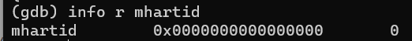
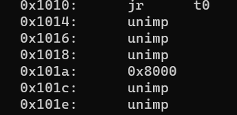

# lab0.5:**最小可执行**内核


## 练习1：**使用GDB验证启动流程**

> 为了熟悉使用qemu和gdb进行调试工作,使用gdb调试QEMU模拟的RISCV计算机加电开始运行到执行应用程序的第一条指令（即跳转到0x80200000）这个阶段的执行过程，说明RISC-V硬件加电后的几条指令在哪里？完成了哪些功能？

加电后的复位地址是0x1000，运行的指令在qemu源码中，路径为**qemu-4.1.1/hw/riscv/virt.c**,用vim查看代码如下

```
 /* reset vector */
    uint32_t reset_vec[8] = {
        0x00000297,                  /* 1:  auipc  t0, %pcrel_hi(dtb) */
        0x02028593,                  /*     addi   a1, t0, %pcrel_lo(1b) */
        0xf1402573,                  /*     csrr   a0, mhartid  */
#if defined(TARGET_RISCV32)
        0x0182a283,                  /*     lw     t0, 24(t0) */
#elif defined(TARGET_RISCV64)
        0x0182b283,                  /*     ld     t0, 24(t0) */
#endif
        0x00028067,                  /*     jr     t0 */
        0x00000000,
        memmap[VIRT_DRAM].base,      /* start: .dword memmap[VIRT_DRAM].base */
        0x00000000,
                                     /* dtb: */
    };
```

使用gdb调试程序得到指令如下

```
0x1000:      auipc   t0,0x0
0x1004:      addi    a1,t0,32
0x1008:      csrr    a0,mhartid
0x100c:      ld      t0,24(t0)
0x1010:      jr      t0
0x1014:      unimp
0x1016:      unimp
0x1018:      unimp
0x101a:      0x8000
0x101c:      unimp
```

可以观察到是一样的，下面通过分析指令解释完成了哪些功能

`auipc   t0,0x0`

auipc指令，指令全称叫add upper immediate to PC，作用如下：

1. 将20位的立即数左移12位，得到一个32位的无符号整数。
2. 将当前PC（程序计数器）的高20位与上一步得到的32位整数相加，得到一个32位的结果。
3. 将上一步得到的结果存储到目标寄存器中。

指令执行后t0存的是0x1000

`addi    a1,t0,32`

此时a1存的是0x1020

`csrr    a0,mhartid`

此指令RISC-V指令集中的一条特权指令，用于将mhartid寄存器的值加载到目标寄存器a0中。mhartid寄存器是RISC-V中的一个特殊寄存器，用于存储当前硬件线程的ID。

在多核系统中，每个硬件线程都有一个唯一的ID，可以通过mhartid寄存器来访问。通过加载mhartid寄存器的值，可以获取当前线程的ID，从而用于多核编程中的线程间通信、任务分配等操作。

需要注意的是，`csrr a0, mhartid`是一条特权指令，只能在特权级别（如M模式或S模式）下执行，而不能在用户级别（U模式）下执行。



通过gdb判断出此时a0存的是0x0

`ld      t0,24(t0)`

ld指令是从对应地址加载64位数据到指定寄存器，24(t0）所指地址为0x1018



从上图中很容易看出从0x1018取8个字节数据为0x0000000080000000，存到t0寄存器中

`jr      t0`

无条件跳转到上述地址位置，也就是0x80000000，运行bootloader

查看0x80000000处的代码

```
(gdb) x/10i $pc
=> 0x80000000:	csrr	a6,mhartid
   0x80000004:	bgtz	a6,0x80000108
   0x80000008:	auipc	t0,0x0
   0x8000000c:	addi	t0,t0,1032
   0x80000010:	auipc	t1,0x0
   0x80000014:	addi	t1,t1,-16
   0x80000018:	sd	t1,0(t0)
   0x8000001c:	auipc	t0,0x0
   0x80000020:	addi	t0,t0,1020
   0x80000024:	ld	t0,0(t0)
```

可以定位到/qemu-4.1.1/roms/opensbi/firmware/fw_base.S中`_start`标签处的代码

```
_start:
	/*
	 * Jump to warm-boot if this is not the first core booting,
	 * that is, for mhartid != 0
	 */
	csrr	a6, CSR_MHARTID
	blt	zero, a6, _wait_relocate_copy_done

	/* Save load address */
	la	t0, _load_start
	la	t1, _start
	REG_S	t1, 0(t0)
```

如果当前核心是第一个启动的核心,会继续执行下列指令

```
_relocate:
	la	t0, _link_start
	REG_L	t0, 0(t0)
	la	t1, _link_end
	REG_L	t1, 0(t1)
	la	t2, _load_start
	REG_L	t2, 0(t2)
	sub	t3, t1, t0
	add	t3, t3, t2
	beq	t0, t2, _relocate_done
	la	t4, _relocate_done
	sub	t4, t4, t2
	add	t4, t4, t0
	blt	t2, t0, _relocate_copy_to_upper
```

这段指令主要作用是将链接地址存储到t0，将加载地址存储到t2，如果t0和t2相等就跳转到`_relocate_done`。

```
_relocate_done:

	/* mark relocate copy done */
	la	t0, _boot_status
	li	t1, 1
	REG_S	t1, 0(t0)
	fence	rw, rw

	/* At this point we are running from link address */

	/* Reset all registers for boot HART */
	li	ra, 0
	call	_reset_regs

	/* Allow main firmware to save info */
	MOV_5R	s0, a0, s1, a1, s2, a2, s3, a3, s4, a4
	call	fw_save_info
	MOV_5R	a0, s0, a1, s1, a2, s2, a3, s3, a4, s4

	/* Preload HART details
	 * s7 -> HART Count
	 * s8 -> HART Stack Size
	 */
	la	a4, platform
#if __riscv_xlen == 64
	lwu	s7, SBI_PLATFORM_HART_COUNT_OFFSET(a4)
	lwu	s8, SBI_PLATFORM_HART_STACK_SIZE_OFFSET(a4)
#else
	lw	s7, SBI_PLATFORM_HART_COUNT_OFFSET(a4)
	lw	s8, SBI_PLATFORM_HART_STACK_SIZE_OFFSET(a4)
#endif

	/* Setup scratch space for all the HARTs*/
	la	tp, _fw_end
	mul	a5, s7, s8
	add	tp, tp, a5
	/* Keep a copy of tp */
	add	t3, tp, zero
	/* Counter */
	li	t2, 1
	/* hartid 0 is mandated by ISA */
	li	t1, 0
```

这段指令用于初始化寄存器、保存关键数据和为多个HART（处理器核心）分配临时空间。

对`_relocate_done`的代码进一步分析可以得知，这段指令执行完毕后，会继续执行`_scratch_init`处的指令。其中有1条重要指令

```
call	fw_next_addr
```

这条指令会跳转到fw_jumps.S文件中的`fw_next_addr`处，此处有一个关键的参数`FW_JUMP_ADDR`，这对应加载到下一个引导阶段的地址。这个参数在编译openSBI时设定，这里被设定为0x80200000。

执行完这条指令后，scratch的next_addr属性值就设成了`FW_JUMP_ADDR`的值。

随后继续分析，可以发现程序接下来按以下顺序依次执行

```
_bss_zero -> _prev_arg1_override_done -> _fdt_reloc_done -> _start_warm
```

`_bss_zero`主要作用是初始化BSS段，遍历BSS段中的未初始化变量或数据，并在每次迭代中调用函数fw_prev_arg1，然后根据函数返回值来确定是否执行跳转。

`_prev_arg1_override_done`的作用是将一个FDT从一个地址复制到另一个地址，并执行地址对齐、字节重新排列等操作，以确保复制的数据正确。

`_fdt_reloc_done`的作用是将引导的HART标记为已完成引导，然后跳转到引导完成后的下一步操作。

`_start_warm`的作用是在引导完成后，为非引导HART执行一系列的初始化和设置操作，包括寄存器的重置、中断的禁用、临时空间的分配、堆栈的设置、陷阱处理器的配置以及SBI运行时的初始化。这确保了非引导HART在启动后以预期的状态开始执行。

在`_start_warm`中调用sbi_init.c中的`sbi_init`函数，在这里又继续调用sbi_system.c中的`sbi_hart_switch_mode`函数，最终完成将内核加载到0x80200000处的工作，至此分析结束。


> 列出你认为本实验中重要的知识点，以及与对应的OS原理中的知识点，并简要说明你对二者的含义，关系，差异等方面的理解（也可能出现实验中的知识点没有对应的原理知识点）

- **进程管理** 在 `RISC-V` 处理器加电后进行引导指令时，会涉及引导加载程序启动进程，包括加载内核代码和初始化进程控制块。当操作系统内核启动后，它将负责创建和管理进程，包括分配进程控制块，分配内存空间，初始化寄存器等。此外，还涉及到了上下文切换，从一个进程切换到另一个进行进行执行，需要保存当前进程状态，并且加载下一个进程状态。

- **内存管理** 在引导过程中，操作系统需要初始化物理内存，虚拟内存，并且为进程分配和释放内存，满足进程的动态内存需求，此外，还需要控制内存保护，内存交换和异常处理等。

- **设备驱动程序** 在引导过程中，操作系统需要初始化计算机中各种硬件设备，提供借口，使得操作系统可以与硬件设备之间进行通信，允许操作系统向设备发送命令，读取数据和将数据写入设备，此外还涉及中断处理，提供设备抽象层等等。


> 列出你认为OS原理中很重要，但在实验中没有对应上的知识点

- 不同架构的处理器加电后的启动流程不尽相同，对于PC而言简要来说就是先从BIOS上执行大概两个操作，其一是硬件自检，按顺序检查主板相应位置上是否有对应硬件，这也是为什么电脑开机显示器不亮大概率是内存坏了。其二就是将bootloader加载到内存中，这个bootloader存在硬盘上0面0道1扇区位置，也称之为主引导扇区，主引导扇区上包括主引导记录(MBR)以及分区表，帮助找到系统盘从而找到启动程序加载系统内核。
- 然而qemu的riscv架构的加电开机流程与上述略有不同，而经查资料得知BIOS和bootloader作用功能大致相同，所以不少手机厂商将其直接合并为一个固件，而PC仍保持分离个人猜测其原因是历史遗留问题或者分开方便管理维护以及后续开发。
